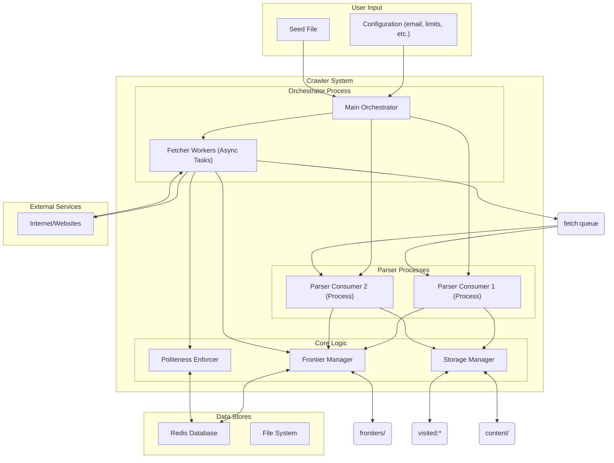

# Web Crawler Project Plan

## 1. Introduction

This document outlines the plan for building an experimental web crawler. The primary goals are:
1.  Run on a single machine, crawling up to 7.5 million pages in 24 hours from a seed list of domains.
2.  Store text content of crawled pages.
3.  Adhere to politeness standards (`robots.txt`, crawl delays, informative User-Agent).
4.  Be fault-tolerant, allowing stopping and resuming.
5.  Provide a way to inspect progress and crawled data.

The project prioritizes simplicity, using Python as the core language. The architecture is designed for high performance on a single machine.

## 2. Architecture

The crawler uses a multi-process, Redis-based architecture designed for high throughput. It separates I/O-bound fetching from CPU-bound parsing.

### 2.1. Core Components

*   **Main Orchestrator (`orchestrator.py`):** The central controller that manages the entire crawl lifecycle. It spawns and supervises fetcher tasks and parser processes.
*   **Fetcher Workers (in `orchestrator.py`):** A pool of asynchronous tasks responsible for fetching URLs from the web. They are lightweight and focus solely on I/O.
*   **Parser Consumers (`parser_consumer.py`):** Separate processes dedicated to parsing HTML. They consume raw HTML from a Redis queue, extract text and links, and save results. This prevents CPU-intensive parsing from blocking the fetchers.
*   **Frontier Manager (`frontier.py`):** Manages the URLs to be crawled using a hybrid storage approach:
    *   **Redis:** Stores coordination data, domain metadata (politeness rules, next fetch times), a "seen" URL bloom filter for fast de-duplication, and an exact set of "visited" URLs.
    *   **File System:** Stores the actual frontier of URLs in append-only files, one per domain. This allows for a virtually unlimited frontier size without consuming excessive memory.
*   **Storage Manager (`storage.py`):** Handles persistence. It saves visited page metadata to Redis and the extracted text content to the file system.
*   **Politeness Enforcer (`politeness.py`):** Manages `robots.txt` rules and crawl delays, using Redis as a cache for politeness information.
*   **Fetcher (`fetcher.py`):** The underlying asynchronous HTTP client (`aiohttp`) used by the fetcher workers.

### 2.2. Data Flow

1.  **Initialization:**
    *   The Main Orchestrator starts, connects to Redis, and initializes the components.
    *   It loads seed URLs into the Frontier. If resuming, it uses existing data in Redis and the file system.
    *   It spawns one or more Parser Consumer processes.
2.  **Fetching Loop (Async Tasks):**
    *   The Frontier Manager provides a ready URL to a fetcher worker, respecting politeness delays.
    *   The fetcher worker downloads the page content.
    *   If the content is HTML, the worker pushes the raw HTML and metadata (URL, depth, etc.) to a Redis queue (`fetch:queue`).
    *   The fetcher worker is now free to immediately get another URL from the frontier.
3.  **Parsing Loop (Separate Process):**
    *   A Parser Consumer process pops an HTML job from the `fetch:queue`.
    *   It parses the HTML to extract the main text content and new links.
    *   The Storage Manager saves the text content to a file.
    *   The Frontier Manager adds the new, valid, and unseen links to the appropriate domain's frontier file.
    *   The Storage Manager records the URL as "visited" in Redis.
4.  **Termination:** The process continues until a crawl limit is reached or the frontier is exhausted.

### 2.3. Concurrency Model

*   **Fetcher Concurrency:** The orchestrator runs a large number of `asyncio` tasks for fetching, maximizing I/O-bound operations. This is configured by `--max-workers`.
*   **Parser Parallelism:** The orchestrator runs multiple parser processes (`multiprocessing.Process`), typically 2 by default. Each parser process then runs its own `asyncio` event loop with multiple concurrent tasks to process pages from the Redis queue. This parallelizes the CPU-bound parsing work.

### 2.4. Architecture Diagram



## 3. Key Data Structures and Storage

The crawler uses a hybrid of Redis and the file system for persistence.

### 3.1. Redis Data Structures

*   **Domain Metadata (Hash):** `domain:{domain}`
    *   `file_path`: Path to the domain's frontier file.
    *   `frontier_offset`: Byte offset for the next URL to read from the file.
    *   `frontier_size`: Total size in bytes of the frontier file.
    *   `next_fetch_time`: UNIX timestamp for when this domain can be crawled next.
    *   `robots_txt`: Cached content of `robots.txt`.
    *   `robots_expires`: Expiry timestamp for the `robots.txt` cache.
    *   `is_excluded`: Flag for manually excluded domains.
*   **Domain Ready Queue (List):** `domains:queue`
    *   A simple list of domains that have URLs in their frontier. The orchestrator uses this as a work queue.
*   **"Seen" URLs (Bloom Filter):** `seen:bloom`
    *   A probabilistic data structure used for fast, memory-efficient de-duplication of all URLs ever encountered. This prevents re-adding URLs to the frontier.
*   **"Visited" URLs (Hashes):** `visited:{url_hash}`
    *   An exact record of every URL that has been fetched (or attempted). Stores metadata like status code, content hash, timestamp, and content path.
*   **Parser Queue (List):** `fetch:queue`
    *   A list used as a queue to pass raw HTML from fetchers to parsers.
*   **Domain Write Locks (Keys):** `lock:domain:{domain}`
    *   Simple keys used with `SETNX` to ensure that only one parser process can write to a domain's frontier file at a time.

### 3.2. File System Storage

*   **Frontier Files:** `crawler_data/frontiers/{domain_hash_prefix}/{domain}.frontier`
    *   Append-only files containing the URLs to be crawled for a specific domain, with one `url|depth` entry per line.
*   **Content Files:** `crawler_data/content/`
    *   Extracted text content is stored in files named by a hash of the URL (e.g., `<url_sha256>.txt`). The `visited:*` hashes in Redis link a URL to its content file.

## 4. Politeness Implementation

*   **User-Agent:** A descriptive User-Agent string including the contact email is used for all requests.
*   **`robots.txt`:** Rules are fetched, parsed, and cached in Redis. The `PolitenessEnforcer` checks these rules before any URL is fetched.
*   **Crawl Delay:** A default politeness delay (e.g., 70 seconds) is enforced between requests to the same domain. This can be overridden by a `Crawl-delay` directive in `robots.txt`. The `next_fetch_time` in the `domain:*` Redis hash manages this.

## 5. Fault Tolerance and Resumption

*   **State Persistence:** All critical state is persisted in Redis or the file system.
*   **Redis Persistence:** The provided Docker Compose setup for Redis enables both RDB snapshots and AOF (Append-Only File) for durability.
*   **Resumption:** When the crawler is started with the `--resume` flag, it picks up where it left off using the data in Redis and the frontier files.
*   **Zombie Lock Cleanup:** On startup, the orchestrator scans Redis for and removes any stale domain write locks that might have been left over from a previous crashed run.

## 6. Project Directory Structure (Simplified)

```
crawler/
├── main.py
├── crawler_module/
│   ├── orchestrator.py
│   ├── parser_consumer.py
│   ├── frontier.py
│   ├── storage.py
│   ├── politeness.py
│   ├── fetcher.py
│   ├── parser.py
│   └── ... (other modules)
├── requirements.txt
├── docker-compose.yml  # Includes Redis and monitoring services
├── PLAN.MD             # This document
└── README.md
```

## 7. Dependencies

*   **Python 3.8+**
*   **`redis`**: For Redis communication.
*   **`aiohttp`**: For asynchronous HTTP requests.
*   **`lxml`**: For fast HTML parsing.
*   **`robotexclusionrulesparser`**: For `robots.txt` parsing.
*   **`aiofiles`**: For asynchronous file I/O.
*   **`prometheus_client`**: For exposing metrics.
*   And other utilities... (see `requirements.txt`)