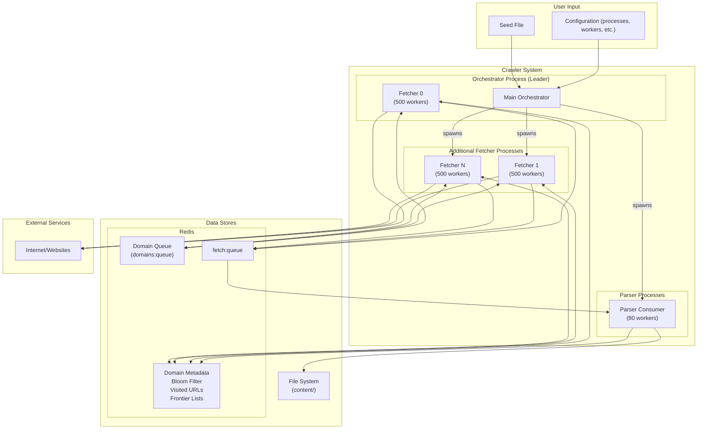

# Web Crawler Project Plan

## 1. Introduction

This document outlines the plan for building an experimental web crawler. The primary goals are:
1.  Run on a single machine, crawling up to 7.5 million pages in 24 hours from a seed list of domains.
2.  Store text content of crawled pages.
3.  Adhere to politeness standards (`robots.txt`, crawl delays, informative User-Agent).
4.  Be fault-tolerant, allowing stopping and resuming.
5.  Provide a way to inspect progress and crawled data.

The project prioritizes simplicity, using Python as the core language. The architecture is designed for high performance on a single machine.

## 2. Architecture

The crawler uses a multi-process, Redis-based architecture designed for high throughput. It separates I/O-bound fetching from CPU-bound parsing.

### 2.1. Core Components

*   **Main Orchestrator (`orchestrator.py`):** The central controller that manages the entire crawl lifecycle. It runs as fetcher process 0 (leader model) while also spawning and supervising additional fetcher and parser processes.
*   **Fetcher Processes (`fetcher_process.py`):** Independent processes that run pools of asynchronous workers for fetching URLs. The orchestrator runs fetcher 0 internally, while additional fetcher processes (1, 2, ...) run separately.
*   **Parser Consumers (`parser_consumer.py`):** Separate processes dedicated to parsing HTML. They consume raw HTML from a Redis queue, extract text and links, and save results. This prevents CPU-intensive parsing from blocking the fetchers.
*   **Frontier Manager (`frontier.py`):** Manages the URLs to be crawled using Redis for all storage:
    *   Stores frontier URLs in Redis lists (`frontier:{domain}`)
    *   Uses Redis for coordination data, domain metadata (politeness rules, next fetch times), a "seen" URL bloom filter for fast de-duplication, an exact set of "visited" URLs, and a single domain queue (`domains:queue`)
    *   All operations are atomic Redis commands - no locking needed
*   **Storage Manager (`storage.py`):** Handles persistence. It saves visited page metadata to Redis and the extracted text content to the file system.
*   **Politeness Enforcer (`politeness.py`):** Manages `robots.txt` rules and crawl delays, using Redis as a cache for politeness information.
*   **Fetcher (`fetcher.py`):** The underlying asynchronous HTTP client (`aiohttp`) used by the fetcher workers.

### 2.2. Data Flow

1.  **Initialization:**
    *   The Main Orchestrator starts, connects to Redis, and performs one-time initialization (DB schema, manual exclusions, frontier initialization).
    *   It creates its own FetcherProcess instance (fetcher 0), spawns additional fetcher processes (1+), and parser processes.
2.  **Fetching Loop (Multiple Processes):**
    *   All fetcher processes read from the single domain queue.
    *   The Frontier Manager provides a ready URL from the queue, respecting politeness delays.
    *   The fetcher worker downloads the page content.
    *   If the content is HTML, the worker pushes the raw HTML and metadata (URL, depth, etc.) to a Redis queue (`fetch:queue`).
    *   The fetcher worker is now free to immediately get another URL.
3.  **Parsing Loop (Separate Process):**
    *   A Parser Consumer process pops an HTML job from the `fetch:queue`.
    *   It parses the HTML to extract the main text content and new links.
    *   The Storage Manager saves the text content to a file.
    *   The Frontier Manager adds the new, valid, and unseen links to the appropriate domain's frontier list in Redis.
    *   The Storage Manager records the URL as "visited" in Redis.
4.  **Termination:** The process continues until a crawl limit is reached or the frontier is exhausted.

### 2.3. Concurrency Model

*   **Process-Level Parallelism:** 
    *   **Fetcher Processes:** Configurable with `--num-fetcher-processes` (default: 2). The orchestrator runs as fetcher 0 (leader model), while additional processes run independently.
    *   **Parser Processes:** Configurable with `--num-parser-processes` (default: 1).
*   **Worker-Level Concurrency:**
    *   **Fetcher Workers:** Each fetcher process runs `--fetcher-workers` async tasks (default: 500).
    *   **Parser Workers:** Each parser process runs `--parser-workers` async tasks (default: 80).
*   **Shared Queue:** All fetcher processes read from a single domain queue in Redis, with atomic operations ensuring no contention.

### 2.4. Architecture Diagram



## 3. Key Data Structures and Storage

The crawler uses a hybrid of Redis and the file system for persistence.

### 3.1. Redis Data Structures

*   **Domain Metadata (Hash):** `domain:{domain}`
    *   `next_fetch_time`: UNIX timestamp for when this domain can be crawled next.
    *   `robots_txt`: Cached content of `robots.txt`.
    *   `robots_expires`: Expiry timestamp for the `robots.txt` cache.
    *   `is_excluded`: Flag for manually excluded domains.
*   **Frontier Lists:** `frontier:{domain}`
    *   Lists containing URLs to crawl for each domain in "url|depth" format.
*   **Domain Queue (Sorted set):** `domains:queue`
    *   Single sorted set that contains all domains with URLs to crawl. Keys are domains and values are the next fetch time.
*   **"Seen" URLs (Bloom Filter):** `seen:bloom`
    *   A probabilistic data structure used for fast, memory-efficient de-duplication of all URLs ever encountered. This prevents re-adding URLs to the frontier.
*   **"Visited" URLs (Hashes):** `visited:{url_hash}`
    *   An exact record of every URL that has been fetched (or attempted). Stores metadata like status code, content hash, timestamp, and content path.
*   **Parser Queue (List):** `fetch:queue`
    *   A list used as a queue to pass raw HTML from fetchers to parsers.

### 3.2. File System Storage

*   **Content Files:** `crawler_data/content/`
    *   Extracted text content is stored in files named by a hash of the URL (e.g., `<url_sha256>.txt`). The `visited:*` hashes in Redis link a URL to its content file.

## 4. Politeness Implementation

*   **User-Agent:** A descriptive User-Agent string including the contact email is used for all requests.
*   **`robots.txt`:** Rules are fetched, parsed, and cached in Redis. The `PolitenessEnforcer` checks these rules before any URL is fetched.
*   **Crawl Delay:** A default politeness delay (e.g., 70 seconds) is enforced between requests to the same domain. This can be overridden by a `Crawl-delay` directive in `robots.txt`. The `next_fetch_time` in the `domain:*` Redis hash manages this.

## 5. Fault Tolerance and Resumption

*   **State Persistence:** All critical state is persisted in Redis.
*   **Redis Persistence:** The provided Docker Compose setup for Redis uses RDB snapshots only (AOF disabled) for simplicity and lower memory usage. Snapshots occur every 1-15 minutes based on change frequency.
*   **Resumption:** When the crawler is started with the `--resume` flag, it picks up where it left off using the data in Redis.

## 6. Multiprocess Configuration

### 6.1. Process Configuration

The crawler supports configurable numbers of fetcher and parser processes:

*   **`--num-fetcher-processes`** (default: 2): Number of fetcher processes. The orchestrator runs as fetcher 0 (leader), reducing context switching.
*   **`--num-parser-processes`** (default: 1): Number of parser processes.
*   **`--fetcher-workers`** (default: 500): Async workers per fetcher process.
*   **`--parser-workers`** (default: 80): Async workers per parser process.

Example configurations:
*   Light workload: 1 fetcher + 1 parser (500 fetchers + 80 parsers)
*   Balanced (default): 2 fetchers + 1 parser (1000 fetchers + 80 parsers)
*   Parser-heavy: 2 fetchers + 2 parsers (1000 fetchers + 160 parsers)
*   Scale-out: 4 fetchers + 2 parsers (2000 fetchers + 160 parsers)

### 6.2. Process Responsibilities

**Orchestrator (Leader)**
*   Performs one-time initialization (schema, exclusions, frontier)
*   Runs fetcher process 0 internally
*   Spawns and monitors additional processes
*   Handles global stopping conditions

**Fetcher Processes**
*   Read from shared domain queue
*   Fetch content and push to parse queue
*   Respect politeness delays per domain

**Parser Processes**
*   Consume from shared parse queue
*   Extract text and links
*   Update frontier lists with new URLs
*   Save content to filesystem

## 7. Project Directory Structure (Simplified)

```
crawler/
├── main.py
├── crawler_module/
│   ├── orchestrator.py      # Main orchestrator (runs as fetcher 0)
│   ├── fetcher_process.py   # Independent fetcher process logic
│   ├── parser_consumer.py   # Parser process logic
│   ├── frontier.py          # URL frontier with domain sharding
│   ├── storage.py
│   ├── politeness.py
│   ├── fetcher.py
│   ├── parser.py
│   └── ... (other modules)
├── requirements.txt
├── docker-compose.yml  # Includes Redis and monitoring services
├── PLAN.MD             # This document
└── README.md
```

## 7. Dependencies

*   **Python 3.8+**
*   **`redis`**: For Redis communication with async support.
*   **`aiohttp`**: For asynchronous HTTP requests.
*   **`selectolax`**: For fast HTML parsing.
*   **`robotexclusionrulesparser`**: For `robots.txt` parsing.
*   **`aiofiles`**: For asynchronous file I/O.
*   **`prometheus_client`**: For exposing metrics (with multiprocess support).
*   **`psutil`**: For system resource monitoring.
*   And other utilities... (see `requirements.txt`)